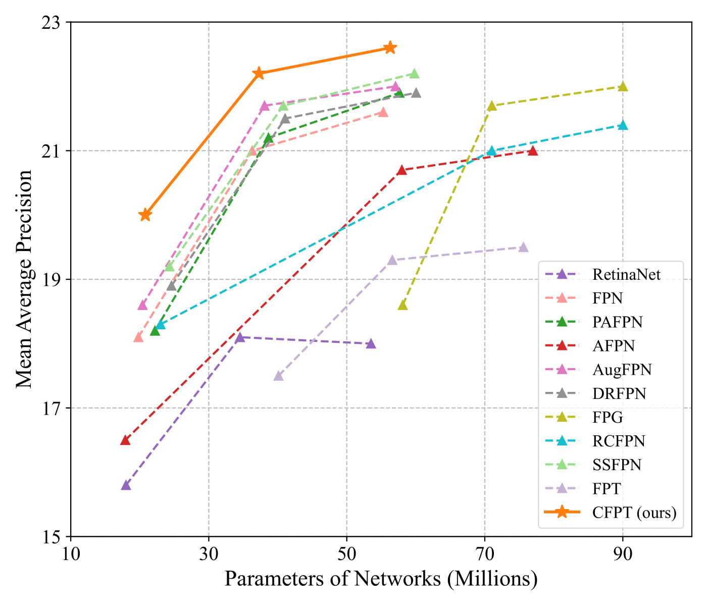
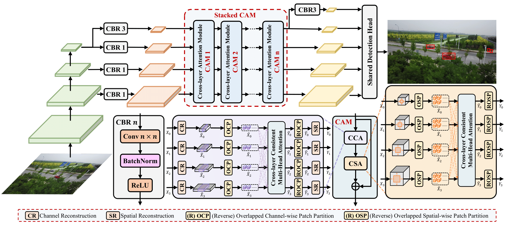

用于航拍图像小目标检测的跨层特征金字塔 Transformer

本仓库提供了CFPT的官方 PyTorch 实现。

在这篇论文中，提出了一种专为航拍图像小目标检测设计的跨层特征金字塔 Transformer。

下图展示了在 VisDrone-2019 DET 数据集上，基于 RetinaNet 的 CFPT 与其他特征金字塔网络的性能对比：

CFPT 的架构如下所示：

## Weights
Due to the accidental deletion of the model weights prepared for this paper, we retrained the entire network, resulting in slight differences in performance metrics compared to the original study.
Model | AP | Log | Link1 | Link2 |
--- |:---:|:---:|:---:|:---:
retinanet_r18_cfpt             | 20.0  | [Log](https://github.com/duzw9311/CFPT/blob/main/resources/retinanet_r18_cfpt.log) | [BaiduNetDisk](https://pan.baidu.com/s/1TkfGcwrp-27nMSXMFas27w?pwd=ael1) | [GoogleDrive](https://drive.google.com/file/d/1toxJzG18I4mCW_CwhG3NQ0uoquhJB6Pg/view?usp=drive_link)
retinanet_r50_cfpt              | 22.4 | [Log](https://github.com/duzw9311/CFPT/blob/main/resources/retinanet_r50_cfpt.log) | [BaiduNetDisk](https://pan.baidu.com/s/1oNGWQdcdUqaxwplltYydag?pwd=08nv) | [GoogleDrive](https://drive.google.com/file/d/13yp1FYhMf63ZiAzC-ulO1FMl5cImJmDS/view?usp=drive_link)
retinanet_r101_cfpt             | 22.6 | [Log](https://github.com/duzw9311/CFPT/blob/main/resources/retinanet_r101_cfpt.log) | [BaiduNetDisk](https://pan.baidu.com/s/1jWf3vYDW253y7eIqJ1AUYg?pwd=7n7p) | [GoogleDrive](https://drive.google.com/file/d/15MC5C7jOUjgr1DMHGmUpvs7xjvWMR6-J/view?usp=drive_link)

安装
我们的实验基于 torch 1.10+cu113、mmdet 2.24.1 和 mmcv-full 1.6.0。

有关 MMDetection 的基本使用方法，请参阅get_started.md。

1安装 PyTorch。
2安装 mmcv-full 和 MMDetection 工具箱。
pip install openmim
mim install mmcv-full==1.6.0
3安装 albumentations 和其他包。
pip install einops
pip install timm
pip install yapf==0.40.1
pip install albumentations==1.1.0
4安装 albumentations 和其他包。
git clone https://github.com/duzw9311/CFPT.git
cd ./CFPT
pip install -e .
使用方法
数据准备
下载转换为 COCO 标注格式的 VisDrone2019-DET 数据集。您可以从这个链接下载。[link](https://pan.baidu.com/s/1H_MtU-eSGI5jUJE-EcLynQ?pwd=2e3t).

训练
bash
python tools/train.py configs/CFPT/retinanet_r18_cfpt_1x_visdrone.py 

测试
bash
python tools/test.py configs/CFPT/retinanet_r18_cfpt_1x_visdrone.py work_dirs/retinanet_r18_cfpt_1x_visdrone/latest.pth --eval bbox
